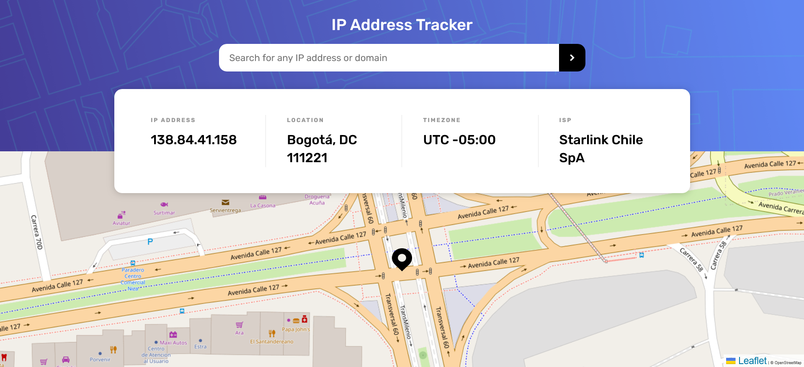

# Frontend Mentor: solución de seguimiento de direcciones IP

Esta es una solución al [desafío del seguimiento de direcciones IP en Frontend Mentor] (https://www.frontendmentor.io/challenges/ip-address-tracker-I8-0yYAH0). Los desafíos de Frontend Mentor lo ayudan a mejorar sus habilidades de codificación mediante la creación de proyectos realistas.

## Tabla de contenido

- [Frontend Mentor: solución de seguimiento de direcciones IP](#frontend-mentor-solución-de-seguimiento-de-direcciones-ip)
  - [Tabla de contenido](#tabla-de-contenido)
  - [Descripción general](#descripción-general)
    - [El reto](#el-reto)
    - [Captura de pantalla](#captura-de-pantalla)
      - [Diseño Mobile](#diseño-mobile)
      - [Diseño Desktop](#diseño-desktop)
    - [Enlaces](#enlaces)
  - [Mi proceso](#mi-proceso)
    - [Construido con](#construido-con)
  - [Autor](#autor)

## Descripción general

### El reto

Los usuarios deberían poder:

- Ver el diseño óptimo para cada página según el tamaño de pantalla de su dispositivo
- Ver estados de desplazamiento para todos los elementos interactivos en la página
- Ver su propia dirección IP en el mapa en la carga de la página inicial
- Busque direcciones IP o dominios y vea la información clave y la ubicación

### Captura de pantalla

#### Diseño Mobile

#### Diseño Desktop 

### Enlaces

- URL de la solución: [Agregue la URL de la solución aquí](https://your-solution-url.com)
- URL del sitio en vivo: [Agregue la URL del sitio en vivo aquí](https://your-live-site-url.com)

## Mi proceso

### Construido con

- Marcado semántico HTML5
- Propiedades personalizadas de CSS
- flexbox 
- Flujo de trabajo móvil primero
- POO
- GULP
- SASS
- Modulos
- [leafletjs](https://leafletjs.com/) - Genera el mapa
- [ipwho](http://ipwho.is/) - consulta la informacion de la IP address

- URL de la solución: [Github](https://github.com/jean266/address-ip)
- URL del sitio en vivo: [vercel](https://address-ip-mykt.vercel.app/)

## Autor

- Mentor de frontend - [@jean266](https://www.frontendmentor.io/profile/jean266)

